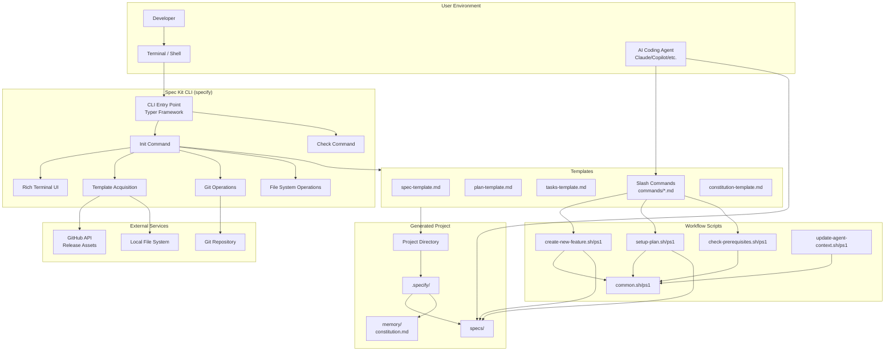
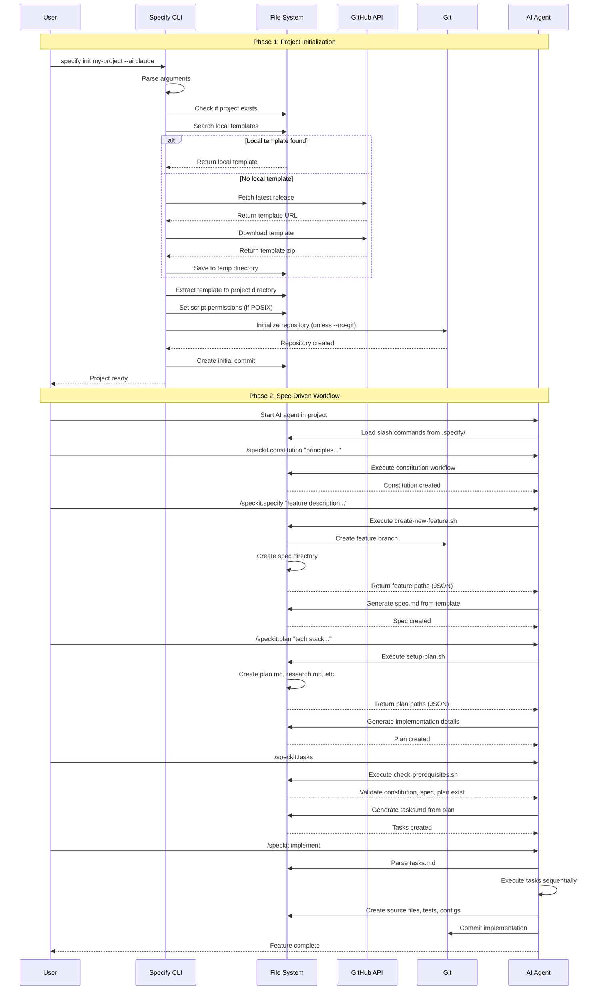
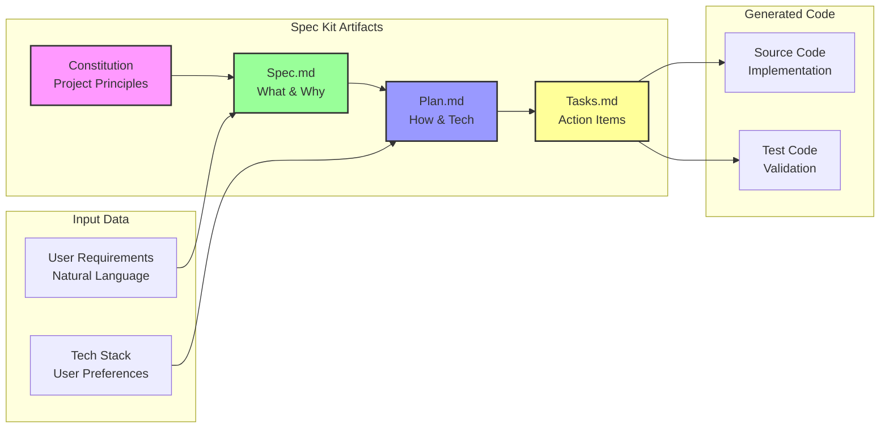
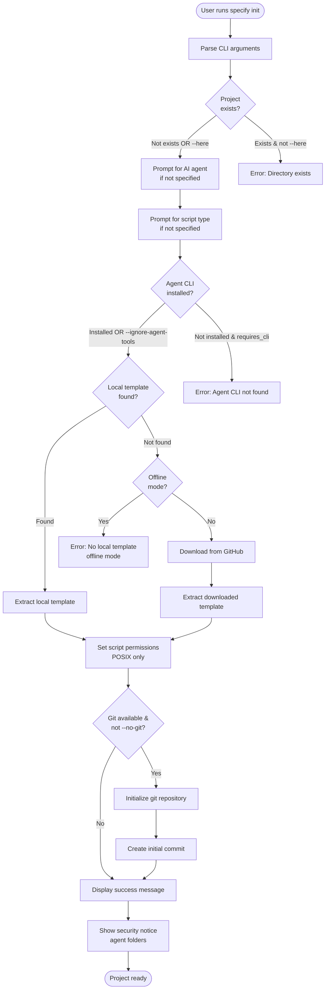
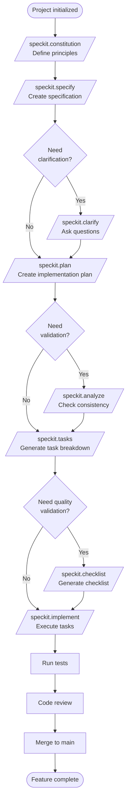

# High-Level Design (HLD)
# Spec Kit (specify-cli)

**Version:** 0.0.20
**Design Date:** 2025-10-28
**Designed By:** Claude Code

---

## Table of Contents

1. [System Overview](#system-overview)
2. [Architecture Diagram](#architecture-diagram)
3. [Component Descriptions](#component-descriptions)
4. [Data Architecture](#data-architecture)
5. [Technology Stack](#technology-stack)
6. [External Integrations](#external-integrations)
7. [Workflow Design](#workflow-design)
8. [Scalability & Performance](#scalability--performance)
9. [Security Architecture](#security-architecture)
10. [Deployment Model](#deployment-model)

---

## System Overview

### Purpose and Scope

Spec Kit is a **command-line toolkit** that enables Spec-Driven Development (SDD) - a methodology where specifications drive implementation rather than code-first development. The system consists of:

1. **CLI Tool** (`specify` command) - Bootstraps SDD projects
2. **Workflow Scripts** - Automate spec-to-code workflow phases
3. **Template System** - Provides structured templates for specifications, plans, and tasks
4. **AI Agent Integration** - Enables 13+ AI coding agents to execute SDD workflows

### System Boundaries

```
┌─────────────────────────────────────────────────────────────────┐
│                        Spec Kit System                          │
│                                                                 │
│  ┌──────────────┐  ┌──────────────┐  ┌──────────────────────┐ │
│  │   specify    │  │   Scripts    │  │   Templates          │ │
│  │   CLI Tool   │  │   (bash/ps1) │  │   (Markdown)         │ │
│  └──────────────┘  └──────────────┘  └──────────────────────┘ │
│                                                                 │
└─────────────────────────────────────────────────────────────────┘
        │                     │                      │
        ↓                     ↓                      ↓
┌───────────────┐   ┌──────────────────┐   ┌─────────────────┐
│  AI Agents    │   │   Git / VCS      │   │  GitHub API     │
│  (External)   │   │   (Optional)     │   │  (Optional)     │
└───────────────┘   └──────────────────┘   └─────────────────┘
```

**In Scope**:
- Project initialization and setup
- Template acquisition (local and remote)
- Workflow script execution
- Agent configuration
- Progress tracking and UI

**Out of Scope**:
- Code generation (delegated to AI agents)
- Project hosting / SaaS
- Collaborative editing
- Continuous Integration (CI/CD pipelines are user responsibility)

### Key System Characteristics

| Characteristic | Value | Rationale |
|----------------|-------|-----------|
| **Architecture** | Monolithic Single-File | Easy distribution, simple packaging |
| **Deployment** | CLI Tool (local) | Runs on user's machine, no server |
| **State Management** | Filesystem-based | No database, project state in `.specify/` directory |
| **Concurrency** | Single-threaded | CLI tool executes one command at a time |
| **Network Dependency** | Optional | Offline mode with local templates |
| **Platform Support** | Cross-platform | Linux, macOS, Windows (via bash/PowerShell scripts) |

---

## Architecture Diagram

### High-Level System Architecture



### Component Interaction Flow



---

## Component Descriptions

### 1. CLI Tool (`specify`)

**Location**: `src/specify_cli/__init__.py`

**Responsibilities**:
- Parse command-line arguments
- Orchestrate project initialization
- Manage template acquisition and extraction
- Handle git repository operations
- Display progress and user feedback

**Key Classes/Functions**:

| Name | Type | Lines | Purpose |
|------|------|-------|---------|
| `app` | Typer | 360-366 | CLI application entry point |
| `init()` | Command | 1161-1462 | Initialize new project |
| `check()` | Command | 1474-1514 | Check installed tools |
| `StepTracker` | Class | 169-252 | Track and display workflow steps |
| `download_and_extract_template()` | Function | 872-1113 | Template acquisition and extraction |
| `AGENT_CONFIG` | Dictionary | 67-153 | Agent configuration registry |

**Dependencies**:
- **Typer**: CLI framework (command parsing, argument validation)
- **Rich**: Terminal UI (colors, panels, progress bars, trees)
- **httpx**: HTTP client (GitHub API, template downloads)
- **truststore**: SSL/TLS (certificate validation)
- **readchar**: Keyboard input (arrow key navigation)

**Interfaces**:
- **Input**: Command-line arguments (project name, flags, options)
- **Output**: Terminal UI (Rich formatted), exit codes (0 = success, 1 = error)
- **Side Effects**: File system modifications, git operations, network requests

**Configuration**:
- `AGENT_CONFIG`: Hardcoded agent configurations
- `SCRIPT_TYPE_CHOICES`: Script type options (sh, ps)
- `CLAUDE_LOCAL_PATH`: Special path for Claude CLI after migration

---

### 2. Workflow Scripts

**Location**: `scripts/bash/*.sh` and `scripts/powershell/*.ps1`

**Responsibilities**:
- Implement SDD workflow steps
- Manage feature numbering and branching
- Validate prerequisites
- Update agent context files

**Key Scripts**:

#### 2.1. `create-new-feature.sh/ps1`

**Purpose**: Create new feature specification with branch and directory.

**Inputs**:
- `$ARGS`: Feature description (natural language)
- `--json`: Output format flag
- `--short-name <name>`: Optional custom short name
- `--number <N>`: Optional manual feature number

**Outputs** (JSON):
```json
{
  "BRANCH_NAME": "001-user-auth",
  "SPEC_FILE": "/path/to/specs/001-user-auth/spec.md",
  "FEATURE_NUM": "001"
}
```

**Logic**:
1. Parse feature description
2. Generate short name (filter stop words, keep meaningful 2-4 words)
3. Determine next feature number (scan specs directory + git branches)
4. Create git branch (if git available)
5. Create spec directory
6. Copy spec template
7. Set `SPECIFY_FEATURE` environment variable

**Key Functions** (bash):
- `generate_branch_name()`: Filter stop words, preserve technical terms
- `check_existing_branches()`: Query git branches (local + remote)
- `find_repo_root()`: Locate repository root directory

---

#### 2.2. `setup-plan.sh/ps1`

**Purpose**: Create planning structure for feature implementation.

**Inputs**:
- `--json`: Output format flag

**Outputs** (JSON):
```json
{
  "FEATURE_SPEC": "/path/to/specs/001-user-auth/spec.md",
  "IMPL_PLAN": "/path/to/specs/001-user-auth/plan.md",
  "SPECS_DIR": "/path/to/specs/001-user-auth",
  "BRANCH": "001-user-auth",
  "HAS_GIT": "true"
}
```

**Logic**:
1. Load common functions
2. Get feature paths (from current branch or `SPECIFY_FEATURE`)
3. Validate feature branch naming
4. Create feature directory (if not exists)
5. Copy plan template to feature directory

---

#### 2.3. `check-prerequisites.sh/ps1`

**Purpose**: Validate required files exist before workflow steps.

**Inputs**:
- `--json`: Output format flag
- `--require-tasks`: Tasks.md must exist (for implementation phase)
- `--include-tasks`: Include tasks.md in available docs list
- `--paths-only`: Only output paths, skip validation

**Outputs** (JSON):
```json
{
  "FEATURE_DIR": "/path/to/specs/001-user-auth",
  "AVAILABLE_DOCS": ["research.md", "data-model.md", "contracts/"]
}
```

**Logic**:
1. Validate feature directory exists
2. Validate plan.md exists
3. Validate tasks.md exists (if `--require-tasks`)
4. Enumerate optional documents (research.md, data-model.md, contracts/, quickstart.md)
5. Output JSON or human-readable format

---

#### 2.4. `update-agent-context.sh/ps1`

**Purpose**: Update agent-specific context files (CLAUDE.md, copilot-instructions.md, etc.) after planning phase.

**Logic**:
1. Detect current agent from project structure
2. Read agent template file
3. Populate with project-specific information
4. Write to agent context file in project root

---

#### 2.5. `common.sh/ps1`

**Purpose**: Shared functions for all workflow scripts.

**Key Functions**:
- `get_repo_root()`: Find repository root (git or `.specify` marker)
- `get_current_branch()`: Determine current branch (git, `SPECIFY_FEATURE`, or latest spec)
- `has_git()`: Check if git is available
- `check_feature_branch()`: Validate feature branch naming
- `get_feature_paths()`: Export all feature-related paths as env variables
- `find_feature_dir_by_prefix()`: Find spec directory by numeric prefix

**Environment Variables**:
- `SPECIFY_FEATURE`: Override branch detection for non-git workflows
- `GH_TOKEN` / `GITHUB_TOKEN`: GitHub API authentication
- `SPECIFY_OFFLINE`: Enable offline mode
- `CODEX_HOME`: Codex CLI home directory (agent-specific)

---

### 3. Template System

**Location**: `templates/`

**Responsibilities**:
- Provide structured formats for specifications, plans, tasks
- Define slash command workflows
- Guide AI agents with placeholders and examples

**Key Templates**:

#### 3.1. `spec-template.md`

**Purpose**: Structure for feature specifications.

**Sections**:
1. **Metadata**: Feature branch, created date, status, input description
2. **User Scenarios & Testing**: Prioritized user stories (P1, P2, P3) with independent testability
3. **Requirements**: Functional requirements (FR-001, FR-002, ...) with clarification markers
4. **Key Entities**: Data entities (if applicable)
5. **Success Criteria**: Measurable outcomes
6. **Review & Acceptance Checklist**: Quality validation

**Placeholder Syntax**:
- `[FEATURE NAME]` - Replace with actual name
- `[###-feature-name]` - Branch name
- `[DATE]` - Creation date
- `$ARGUMENTS` - User input from `/speckit.specify` command
- `[NEEDS CLARIFICATION: ...]` - Mark unclear requirements

---

#### 3.2. `plan-template.md`

**Purpose**: Structure for implementation plans.

**Sections**:
1. **Implementation Strategy**: Overall approach
2. **Tech Stack & Dependencies**: Libraries, frameworks, versions
3. **Architecture & Components**: System structure
4. **Data Flow**: Information flow through system
5. **Testing Strategy**: Test approach (unit, integration, E2E)
6. **References**: Links to research.md, data-model.md, contracts/

---

#### 3.3. `tasks-template.md`

**Purpose**: Structure for task breakdowns.

**Format**:
```markdown
## User Story 1: [Title] (Priority: P1)

### Tasks

- [ ] **Task 1.1**: [Description] `[P]`
  - **File**: `path/to/file.py`
  - **Details**: ...

- [ ] **Task 1.2**: [Description]
  - **File**: `path/to/file.py`
  - **Dependencies**: Task 1.1
  - **Details**: ...

### Checkpoint
- [ ] Validate independent functionality for User Story 1
```

**Conventions**:
- `[P]` marker: Task can run in parallel with others
- Task numbering: `{story}.{task}` (e.g., 1.1, 1.2, 2.1)
- File paths: Exact locations for implementation
- Dependencies: Explicit task ordering

---

#### 3.4. Slash Commands (`commands/*.md`)

**Purpose**: Define AI agent workflows for SDD phases.

**Structure**:
```markdown
---
scripts:
  sh: scripts/bash/script-name.sh --json "{ARGS}"
  ps: scripts/powershell/script-name.ps1 -Json "{ARGS}"
---

# User Input

$ARGUMENTS

# Execution Instructions

## Step 1: [Action]
[Detailed instructions for AI agent]

## Step 2: [Action]
[More instructions...]
```

**Available Commands**:
1. `/speckit.constitution` - Create project principles
2. `/speckit.specify` - Create feature specification
3. `/speckit.clarify` - Clarify requirements (optional)
4. `/speckit.plan` - Create implementation plan
5. `/speckit.analyze` - Analyze consistency (optional)
6. `/speckit.tasks` - Generate task breakdown
7. `/speckit.checklist` - Generate quality checklist (optional)
8. `/speckit.implement` - Execute implementation

---

## Data Architecture

### Data Storage Model

Spec Kit uses **filesystem-based storage** - no database required.

```
project-root/
├── .specify/                      # Spec Kit system directory
│   ├── memory/
│   │   └── constitution.md        # Persistent project principles
│   ├── scripts/                   # Workflow automation scripts
│   │   ├── bash/
│   │   └── powershell/
│   ├── specs/                     # Feature specifications (versioned)
│   │   └── {number}-{short-name}/
│   │       ├── spec.md            # Spec = Source of Truth
│   │       ├── plan.md            # Implementation blueprint
│   │       ├── tasks.md           # Execution roadmap
│   │       ├── research.md        # Technology decisions (ephemeral)
│   │       ├── data-model.md      # Entity definitions (ephemeral)
│   │       ├── quickstart.md      # Setup guide (ephemeral)
│   │       └── contracts/         # API specs (ephemeral)
│   │           ├── api-spec.json
│   │           └── schema.yaml
│   └── templates/                 # Template files (read-only)
├── .{agent}/                      # Agent-specific config (e.g., .claude/)
├── {AGENT}.md                     # Agent context file (e.g., CLAUDE.md)
├── src/                           # Implementation (generated by AI)
├── tests/                         # Tests (generated by AI)
└── .gitignore
```

### Data Flow



### Data Lifecycle

| Artifact | Created By | Lifespan | Versioning | Mutability |
|----------|------------|----------|------------|------------|
| **constitution.md** | `/speckit.constitution` | Project lifetime | Git history | Immutable after governance |
| **spec.md** | `/speckit.specify` | Feature lifetime | Git branch | Editable until implementation |
| **plan.md** | `/speckit.plan` | Feature lifetime | Git branch | Editable until implementation |
| **tasks.md** | `/speckit.tasks` | Feature lifetime | Git branch | Read-only after generation |
| **research.md** | `/speckit.plan` | Planning phase | Git branch | Ephemeral (informational) |
| **data-model.md** | `/speckit.plan` | Planning phase | Git branch | Ephemeral (informational) |
| **contracts/** | `/speckit.plan` | Planning phase | Git branch | Ephemeral (informational) |
| **Source Code** | `/speckit.implement` | Project lifetime | Git commits | Continuous evolution |

---

## Technology Stack

### Core Technologies

| Layer | Technology | Version | Purpose |
|-------|-----------|---------|---------|
| **Language** | Python | 3.11+ | CLI implementation |
| **CLI Framework** | Typer | Latest | Command parsing, argument handling |
| **Terminal UI** | Rich | Latest | Formatted output, progress bars, panels |
| **HTTP Client** | httpx | Latest | GitHub API, template downloads |
| **SSL/TLS** | truststore | >=0.10.4 | Certificate validation |
| **Keyboard Input** | readchar | Latest | Arrow key navigation |
| **Package Manager** | uv / pip | - | Dependency management |

### Scripting Languages

| Platform | Language | Version | Purpose |
|----------|----------|---------|---------|
| **POSIX** (Linux, macOS, WSL) | bash | 4.0+ | Workflow automation |
| **Windows** | PowerShell | 5.1+ / 7.0+ | Workflow automation (mirrors bash) |

### External Services

| Service | Endpoint | Purpose | Offline Capability |
|---------|----------|---------|-------------------|
| **GitHub API** | `api.github.com/repos/github/spec-kit/releases/latest` | Fetch latest template releases | ✅ Yes (local templates) |
| **GitHub Assets** | `github.com/github/spec-kit/releases/download/{tag}/{file}` | Download template zip files | ✅ Yes (local templates) |
| **Git CLI** | Local binary | Version control, branching | ✅ Yes (optional, can skip with `--no-git`) |

### Development Tools

| Tool | Purpose |
|------|---------|
| **uv** | Fast Python package installer and manager |
| **pytest** | Unit and integration testing |
| **black** | Code formatting (if used) |
| **mypy** | Static type checking (if used) |
| **GitHub Actions** | CI/CD (release automation) |

---

## External Integrations

### Integration 1: GitHub API

**Purpose**: Fetch latest template releases for project initialization.

**Endpoint**: `https://api.github.com/repos/github/spec-kit/releases/latest`

**Authentication**:
- Optional: Bearer token via `--github-token` flag or `GH_TOKEN`/`GITHUB_TOKEN` env vars
- Fallback: Unauthenticated (rate limited to 60 requests/hour)

**Request**:
```http
GET /repos/github/spec-kit/releases/latest HTTP/1.1
Host: api.github.com
Accept: application/vnd.github+json
Authorization: Bearer {token}  # Optional
```

**Response**:
```json
{
  "tag_name": "v0.0.20",
  "name": "Release 0.0.20",
  "assets": [
    {
      "name": "spec-kit-template-claude-sh-v0.0.20.zip",
      "browser_download_url": "https://github.com/.../spec-kit-template-claude-sh-v0.0.20.zip",
      "size": 123456
    },
    ...
  ]
}
```

**Error Handling**:
- **Network failure**: Retry with exponential backoff (max 3 attempts)
- **Rate limit (403)**: Display error with instructions to provide token
- **Release not found (404)**: Display error, suggest checking repository URL
- **Offline mode**: Skip GitHub API entirely, use local templates

**Implementation**: `download_template_from_github()` function (lines 762-870)

---

### Integration 2: Git CLI

**Purpose**: Initialize repositories, manage branches, create commits.

**Commands Used**:
- `git rev-parse --show-toplevel` - Find repository root
- `git rev-parse --is-inside-work-tree` - Check if inside repository
- `git rev-parse --abbrev-ref HEAD` - Get current branch name
- `git init` - Initialize new repository
- `git add .` - Stage all files
- `git commit -m "message"` - Create commit
- `git checkout -b {branch}` - Create and switch to new branch
- `git fetch --all --prune` - Fetch all remotes
- `git ls-remote --heads origin` - List remote branches
- `git branch` - List local branches

**Error Handling**:
- **Git not installed**: Gracefully degrade (skip git operations, warn user)
- **Not a git repository**: Support non-git workflows via `SPECIFY_FEATURE` env var
- **Git command failure**: Display stderr, suggest resolution steps

**Implementation**:
- `is_git_repo()` function (lines 439-457)
- `init_git_repo()` function (lines 459-492)
- `check_existing_branches()` in `create-new-feature.sh` (lines 84-112)

---

### Integration 3: Local File System

**Purpose**: Read/write project files, extract templates, manage directory structure.

**Operations**:
- **Read**: Template files, configuration files, JSON script outputs
- **Write**: Project structure, spec files, generated content
- **Extract**: ZIP archives (template files)
- **Permissions**: Set executable bits on shell scripts (POSIX only)
- **Merge**: Deep merge of .vscode/settings.json files

**Key Paths**:
- **Installation templates**: `src/specify_cli/spec-kit-templates/` (bundled with package)
- **Temporary downloads**: System temp directory (cleaned up after extraction)
- **Project root**: User-specified or current directory
- **Spec directory**: `{project-root}/specs/{number}-{short-name}/`

**Error Handling**:
- **Permission denied**: Display error with instructions (chmod, sudo, etc.)
- **Disk space**: Check available space before extraction (warning if <100MB)
- **Path too long**: Validate paths (Windows 260-char limit)

**Implementation**:
- Throughout `__init__.py` using `Path` from `pathlib`
- `handle_vscode_settings()` function (lines 494-516) - Special JSON merge logic
- `ensure_executable_scripts()` function (lines 1116-1158)

---

## Workflow Design

### Workflow 1: Project Initialization



**Performance Characteristics**:
- **Cold start** (no local template): 15-30 seconds
  - GitHub API: 1-3 seconds
  - Template download: 5-15 seconds (depends on network)
  - Extraction: 3-5 seconds
  - Git init: 1-2 seconds
- **Warm start** (local template): 3-5 seconds
  - Template search: <1 second
  - Extraction: 2-3 seconds
  - Git init: 1-2 seconds

---

### Workflow 2: Spec-Driven Development Lifecycle



**Timeline Estimates** (for medium-sized feature):
1. **Constitution**: 30-60 minutes (one-time per project)
2. **Specify**: 15-30 minutes
3. **Clarify** (optional): 10-20 minutes
4. **Plan**: 20-40 minutes
5. **Analyze** (optional): 5-10 minutes
6. **Tasks**: 5-10 minutes
7. **Checklist** (optional): 5-10 minutes
8. **Implement**: 2-8 hours (depends on complexity)

**Total**: 3-10 hours (vs. 6-20 hours for traditional code-first approach)

---

## Scalability & Performance

### Performance Targets

| Operation | Target | Actual (v0.0.20) | Bottleneck |
|-----------|--------|------------------|------------|
| **Project init (local)** | <5 seconds | ~3 seconds | ✅ Meets target |
| **Project init (GitHub)** | <30 seconds | 15-30 seconds | ⚠️ Network dependent |
| **Feature creation** | <2 seconds | ~1 second | ✅ Meets target |
| **Prerequisite check** | <500ms | ~200ms | ✅ Meets target |
| **Template extraction** | <3 seconds | 2-3 seconds | ✅ Meets target |

### Scalability Dimensions

#### 1. Feature Scale

**Current Limits**:
- **Max features**: 999 (3-digit numbering: 001-999)
- **Max specs directory size**: No hard limit (filesystem dependent)
- **Branch name length**: 244 bytes (GitHub limit, enforced)

**Scaling Considerations**:
- Feature numbering wraps after 999 (consider 4-digit format if needed)
- Large specs directories (1,000+ features) may slow filesystem operations
- Recommendation: Archive old features to separate directory if >500 features

#### 2. Template Scale

**Current Limits**:
- **Max template size**: 50MB (recommended), 100MB+ supported
- **Max files in template**: No hard limit (tested up to 500 files)
- **Max directory depth**: 20 levels (reasonable limit)

**Scaling Considerations**:
- Large templates (>100MB) may cause memory issues during extraction
- Use streaming extraction for very large templates (not yet implemented)

#### 3. Concurrent Usage

**Current Behavior**:
- **Single-threaded**: CLI executes one command at a time
- **File locking**: None (potential race conditions)
- **Branch conflicts**: Possible if multiple users create features simultaneously

**Scaling Considerations**:
- Add file locking for feature number allocation
- Implement distributed feature number allocation (e.g., user-specific ranges)
- Consider database for feature tracking (future enhancement)

---

### Performance Optimizations

#### Implemented Optimizations

1. **Local Template Caching**: Templates stored in installation directory, no re-download
2. **Streaming Downloads**: httpx streams large files (no in-memory buffering)
3. **Lazy Imports**: Import statements at function level for rarely-used modules
4. **Git Branch Caching**: Fetch remotes once per script execution
5. **JSON Mode**: Scripts output JSON for fast parsing (no text parsing)

#### Potential Optimizations (Future)

1. **Parallel Template Search**: Search local and GitHub simultaneously
2. **Template Index**: Pre-build index of available templates (avoid scanning)
3. **Compressed Agent Context**: gzip large CLAUDE.md files
4. **Incremental Extraction**: Extract only changed files from template
5. **Background Template Updates**: Check for new releases in background

---

## Security Architecture

### Threat Model

| Threat | Likelihood | Impact | Mitigation |
|--------|------------|--------|------------|
| **Malicious template injection** | Medium | High | Verify template source (GitHub release) |
| **Credential leakage (agent folders)** | High | Critical | Warn users, recommend .gitignore |
| **Man-in-the-middle (GitHub API)** | Low | Medium | TLS verification, truststore |
| **Path traversal (ZIP extraction)** | Low | High | Validate paths, sandboxed extraction |
| **Command injection (script args)** | Low | High | Escape shell arguments, JSON mode |
| **GitHub token exposure** | Medium | High | Use env vars, never log tokens |

### Security Controls

#### 1. Network Security

**TLS/SSL**:
- Uses `truststore` library for system certificate validation
- HTTPS enforced for all GitHub API calls
- `--skip-tls` flag available (not recommended, displays warning)

**Proxy Support**:
- Supports HTTP/HTTPS/SOCKS proxies via httpx
- Respects `HTTP_PROXY`, `HTTPS_PROXY`, `ALL_PROXY` env vars

**Authentication**:
- GitHub tokens supported (optional)
- Tokens passed via `--github-token` flag or env vars (`GH_TOKEN`, `GITHUB_TOKEN`)
- Tokens never logged or displayed in UI

**Code Location**: Lines 54-65 (token handling), lines 762-870 (GitHub API calls)

---

#### 2. File System Security

**Path Validation**:
- Validate user-provided paths (reject absolute paths, `..` traversal)
- Ensure extraction stays within project directory
- Check file permissions before writing

**ZIP Extraction**:
- Validate ZIP structure before extraction
- Reject files with absolute paths or `..` components
- Set safe permissions (755 for directories, 644 for files, 755 for scripts)

**Temporary Files**:
- Use system temp directory (`tempfile.TemporaryDirectory`)
- Clean up temp files after extraction (even on failure)
- Never leave downloaded templates in temp directory

**Code Location**: Lines 995-1112 (extraction logic)

---

#### 3. Credential Management

**Agent Folders**:
- **Risk**: Agent folders (`.claude/`, `.github/`, etc.) may contain credentials, auth tokens, or API keys
- **Warning**: Display security notice after initialization
- **Recommendation**: Add agent folders to `.gitignore`

**Example Security Notice** (displayed after init):
```
╭─── Agent Folder Security ────────────────────────────────────╮
│ Some agents may store credentials, auth tokens, or other     │
│ identifying and private artifacts in the agent folder within │
│ your project.                                                 │
│                                                                │
│ Consider adding .claude/ (or parts of it) to .gitignore to   │
│ prevent accidental credential leakage.                        │
╰────────────────────────────────────────────────────────────────╯
```

**Code Location**: Lines 1417-1429 (security notice)

---

#### 4. Command Injection Prevention

**Script Execution**:
- Use `subprocess.run()` with list arguments (not shell=True)
- Validate script paths (only execute scripts in `.specify/scripts/`)
- Escape user input passed to scripts (JSON encoding)

**JSON Mode**:
- Scripts output JSON (no text parsing)
- Parse JSON with `json.loads()` (safe from injection)
- Validate JSON structure before use

**Code Location**: Lines 390-406 (`run_command()` function)

---

### Compliance Considerations

| Standard | Applicable | Compliance Status |
|----------|-----------|-------------------|
| **GDPR** | No | N/A (no personal data collection) |
| **SOC 2** | No | N/A (no service, local tool) |
| **HIPAA** | No | N/A (no health data) |
| **PCI DSS** | No | N/A (no payment data) |
| **Corporate Security** | Yes | ✅ Offline mode, no telemetry |

**Privacy**:
- **No telemetry**: Spec Kit does not collect usage data
- **No analytics**: No tracking, no phone-home
- **No logging**: Does not log to external services
- **Fully local**: All operations on user's machine

---

## Deployment Model

### Distribution Channels

#### 1. PyPI (Python Package Index)

**Status**: Planned for v1.0.0

**Installation**:
```bash
pip install specify-cli
```

**Benefits**:
- Standard Python package distribution
- Automatic dependency resolution
- Version pinning (`pip install specify-cli==0.0.20`)

**Challenges**:
- Package name availability (may need to squat name)
- Requires active PyPI account and credentials

---

#### 2. GitHub Releases

**Status**: ✅ Active (current method)

**Installation**:
```bash
# Using uv (recommended)
uv tool install specify-cli --from git+https://github.com/typesafeme/spec-kit.git

# Using pip
pip install git+https://github.com/typesafeme/spec-kit.git
```

**Benefits**:
- No PyPI account required
- Immediate availability after commit
- Full control over release process

**Challenges**:
- Requires git installed on user's machine
- Slower installation (must clone repository)

---

#### 3. uvx (One-time Execution)

**Status**: ✅ Active

**Usage**:
```bash
uvx --from git+https://github.com/typesafeme/spec-kit.git specify init my-project
```

**Benefits**:
- No installation required
- Always runs latest version
- Great for CI/CD pipelines

**Challenges**:
- Slower (downloads each time)
- Requires uv installed

---

### Installation Variants

#### Local Development

**Use Case**: Contributors testing changes

**Installation**:
```bash
git clone https://github.com/typesafeme/spec-kit.git
cd spec-kit
pip install -e .
```

**Benefits**:
- Immediate feedback on changes
- Can modify code and test instantly
- Supports debugging

---

#### Corporate / Air-Gapped

**Use Case**: Enterprises without internet access

**Installation**:
1. Download release from GitHub (on internet-connected machine)
2. Transfer to air-gapped machine
3. Install offline:
   ```bash
   pip install specify-cli-0.0.20-py3-none-any.whl --no-index
   ```
4. Place template zip in installation directory:
   ```bash
   cp spec-kit-template-claude-sh-v0.0.20.zip \
      ~/.local/lib/python3.11/site-packages/specify_cli/spec-kit-templates/
   echo "0.0.20" > ~/.local/lib/python3.11/site-packages/specify_cli/spec-kit-templates/version.txt
   ```

**Benefits**:
- Works without internet
- Meets corporate security requirements
- Fully functional offline

---

### Update Strategy

#### Manual Updates

**Using uv**:
```bash
uv tool install specify-cli --force --from git+https://github.com/typesafeme/spec-kit.git
```

**Using pip**:
```bash
pip install --upgrade git+https://github.com/typesafeme/spec-kit.git
```

#### Automatic Update Checking (Future)

**Planned for v0.5.0**:
- Check for new releases on startup (once per day)
- Display notification if new version available
- Opt-in automatic updates

---

### System Requirements

| Component | Minimum | Recommended |
|-----------|---------|-------------|
| **OS** | Linux 4.0+ / macOS 10.15+ / Windows 10 | Linux 5.10+ / macOS 13+ / Windows 11 |
| **Python** | 3.11.0 | 3.11.5+ |
| **RAM** | 512 MB | 1 GB |
| **Disk** | 100 MB | 500 MB (for template caching) |
| **Network** | None (offline mode) | Broadband (GitHub downloads) |
| **Git** | 2.20+ (optional) | 2.40+ |

---

## Appendix

### A: Error Handling Strategy

| Error Category | Strategy | User Experience |
|---------------|----------|-----------------|
| **Network errors** | Retry with backoff (3 attempts) | Show progress, then clear error |
| **File system errors** | Fail fast with resolution steps | Panel with suggested fix |
| **Git errors** | Degrade gracefully | Warn and continue without git |
| **Script errors** | Display stderr, exit non-zero | Panel with script output |
| **Validation errors** | Block operation, suggest fix | Clear error message + next step |

### B: Logging Strategy

**Current**: No persistent logging (stdout/stderr only)

**Future** (v0.3.0):
- Optional log file: `~/.specify/logs/specify.log`
- Rotation: Keep last 10 runs
- Levels: ERROR, WARNING, INFO, DEBUG
- Opt-in via `--log-level` flag

### C: Performance Benchmarks

**Hardware**: MacBook Pro M1, 16GB RAM, SSD

| Operation | Time (seconds) |
|-----------|---------------|
| `specify init --offline` | 2.8 |
| `specify init` (GitHub download) | 18.3 |
| `specify check` | 0.4 |
| `create-new-feature.sh` | 0.9 |
| `setup-plan.sh` | 0.3 |
| `check-prerequisites.sh` | 0.2 |

---

**Document Version:** 1.0
**Last Updated:** 2025-10-28
**Next Review:** After v1.0.0 release
