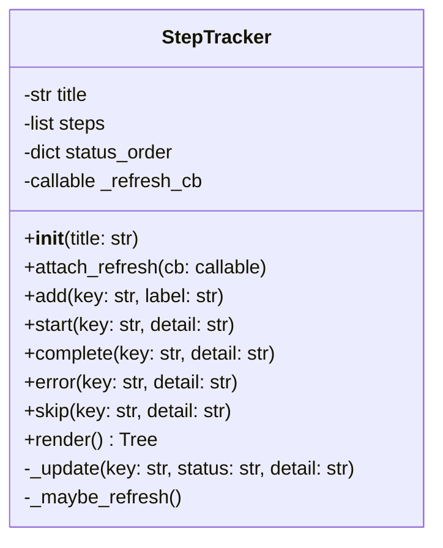
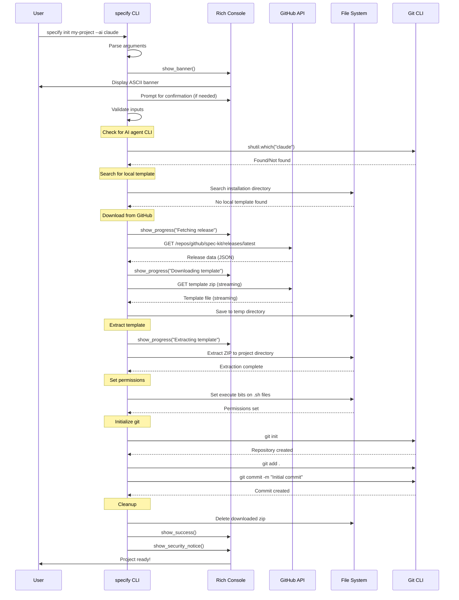
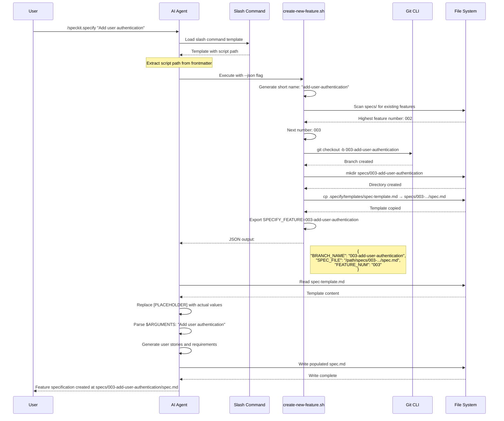
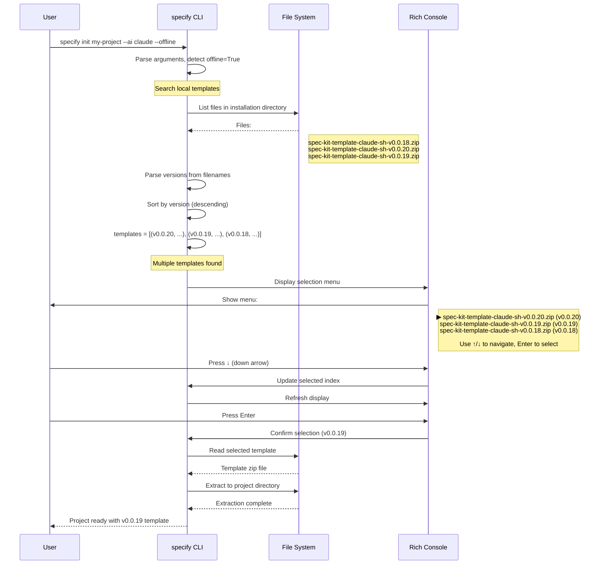

# Low-Level Design (LLD)
# Spec Kit (specify-cli)

**Version:** 0.0.20
**Design Date:** 2025-10-28
**Designed By:** Claude Code

---

## Table of Contents

1. [Module Overview](#module-overview)
2. [Class Specifications](#class-specifications)
3. [Function Specifications](#function-specifications)
4. [Data Structures](#data-structures)
5. [Algorithm Details](#algorithm-details)
6. [Sequence Diagrams](#sequence-diagrams)
7. [Error Handling](#error-handling)
8. [Testing Strategy](#testing-strategy)
9. [Code Examples](#code-examples)

---

## Module Overview

### Module Structure

Spec Kit consists of a single Python module with supporting shell scripts:

```
src/specify_cli/
└── __init__.py                # All CLI logic (1,520 lines)

scripts/
├── bash/                      # POSIX shell scripts
│   ├── create-new-feature.sh  # Feature creation workflow
│   ├── setup-plan.sh          # Planning phase setup
│   ├── check-prerequisites.sh # Prerequisite validation
│   ├── update-agent-context.sh # Agent context file updates
│   └── common.sh              # Shared utility functions
└── powershell/                # Windows equivalent (mirrors bash/)
    └── ...
```

### Import Structure

```python
# Standard library imports
import os
import subprocess
import sys
import zipfile
import tempfile
import shutil
import shlex
import json
import ssl
from pathlib import Path
from typing import Optional, Tuple

# Third-party imports
import typer
import httpx
from rich.console import Console
from rich.panel import Panel
from rich.progress import Progress, SpinnerColumn, TextColumn
from rich.text import Text
from rich.live import Live
from rich.align import Align
from rich.table import Table
from rich.tree import Tree
from typer.core import TyperGroup
import readchar
import truststore
```

**Rationale**: All imports at module level for clarity. No lazy imports (simplicity over micro-optimization).

---

## Class Specifications

### Class 1: `StepTracker`

**Location**: `src/specify_cli/__init__.py:169-252`

**Purpose**: Track and render hierarchical workflow steps with real-time status updates.

**Responsibilities**:
- Maintain list of workflow steps with statuses
- Render progress tree using Rich library
- Support live refresh via callback
- Display status indicators (pending, running, done, error, skipped)

**Class Diagram**:



**Attributes**:

| Name | Type | Description |
|------|------|-------------|
| `title` | `str` | Title displayed at root of tree |
| `steps` | `list[dict]` | List of step dictionaries with keys: `key`, `label`, `status`, `detail` |
| `status_order` | `dict[str, int]` | Mapping of status names to priority (for sorting) |
| `_refresh_cb` | `Optional[callable]` | Callback to trigger UI refresh (set by Live context) |

**Methods**:

#### `__init__(title: str)`
Initialize step tracker with title.
```python
def __init__(self, title: str):
    self.title = title
    self.steps = []
    self.status_order = {
        "pending": 0,
        "running": 1,
        "done": 2,
        "error": 3,
        "skipped": 4
    }
    self._refresh_cb = None
```

#### `attach_refresh(cb: callable) -> None`
Attach refresh callback for live updates.
```python
def attach_refresh(self, cb):
    """Attach callback to trigger UI refresh"""
    self._refresh_cb = cb
```

#### `add(key: str, label: str) -> None`
Add new step with pending status.
```python
def add(self, key: str, label: str):
    """Add step if not already exists"""
    if key not in [s["key"] for s in self.steps]:
        self.steps.append({
            "key": key,
            "label": label,
            "status": "pending",
            "detail": ""
        })
        self._maybe_refresh()
```

#### `start(key: str, detail: str = "") -> None`
Mark step as running.
```python
def start(self, key: str, detail: str = ""):
    """Mark step as running"""
    self._update(key, status="running", detail=detail)
```

#### `complete(key: str, detail: str = "") -> None`
Mark step as completed.
```python
def complete(self, key: str, detail: str = ""):
    """Mark step as completed"""
    self._update(key, status="done", detail=detail)
```

#### `error(key: str, detail: str = "") -> None`
Mark step as errored.
```python
def error(self, key: str, detail: str = ""):
    """Mark step as failed"""
    self._update(key, status="error", detail=detail)
```

#### `skip(key: str, detail: str = "") -> None`
Mark step as skipped.
```python
def skip(self, key: str, detail: str = ""):
    """Mark step as skipped"""
    self._update(key, status="skipped", detail=detail)
```

#### `render() -> Tree` (Public)
Render progress tree for Rich display.
```python
def render(self):
    """Render tree with status indicators and colors"""
    tree = Tree(f"[cyan]{self.title}[/cyan]", guide_style="grey50")

    for step in self.steps:
        label = step["label"]
        detail_text = step["detail"].strip() if step["detail"] else ""
        status = step["status"]

        # Choose symbol and color based on status
        if status == "done":
            symbol = "[green]●[/green]"
        elif status == "pending":
            symbol = "[green dim]○[/green dim]"
        elif status == "running":
            symbol = "[cyan]○[/cyan]"
        elif status == "error":
            symbol = "[red]●[/red]"
        elif status == "skipped":
            symbol = "[yellow]○[/yellow]"
        else:
            symbol = " "

        # Format line with detail
        if status == "pending":
            line = f"{symbol} [bright_black]{label}[/bright_black]"
            if detail_text:
                line += f" [bright_black]({detail_text})[/bright_black]"
        else:
            line = f"{symbol} [white]{label}[/white]"
            if detail_text:
                line += f" [bright_black]({detail_text})[/bright_black]"

        tree.add(line)

    return tree
```

**Status Symbols**:
- ● (filled circle) = completed or error
- ○ (empty circle) = pending, running, or skipped
- Colors: green (done), cyan (running), red (error), yellow (skipped), dim (pending)

**Usage Example**:
```python
tracker = StepTracker("Initialize Specify Project")
tracker.add("precheck", "Check required tools")
tracker.complete("precheck", "ok")
tracker.add("fetch", "Fetch latest release")
tracker.start("fetch")
# ... do work ...
tracker.complete("fetch", "v0.0.20")
console.print(tracker.render())
```

---

### Class 2: `BannerGroup`

**Location**: `src/specify_cli/__init__.py:351-357`

**Purpose**: Custom Typer group that displays ASCII banner before help text.

**Inherits**: `TyperGroup` (from Typer)

**Methods**:

#### `format_help(ctx, formatter) -> None`
Override to show banner before help.
```python
def format_help(self, ctx, formatter):
    """Show banner before help text"""
    show_banner()
    super().format_help(ctx, formatter)
```

**Usage**: Automatically invoked when user runs `specify --help` or `specify`.

---

## Function Specifications

### Core Functions

#### Function 1: `show_banner()`

**Location**: `src/specify_cli/__init__.py:368-380`

**Signature**:
```python
def show_banner() -> None
```

**Purpose**: Display ASCII art banner with gradient coloring.

**Algorithm**:
1. Split `BANNER` constant into lines
2. Define color gradient (bright_blue → blue → cyan → bright_cyan → white → bright_white)
3. Apply colors cyclically to each line
4. Center banner horizontally
5. Display tagline below banner
6. Add empty line for spacing

**Implementation**:
```python
def show_banner():
    """Display the ASCII art banner with gradient colors"""
    banner_lines = BANNER.strip().split('\n')
    colors = ["bright_blue", "blue", "cyan", "bright_cyan", "white", "bright_white"]

    styled_banner = Text()
    for i, line in enumerate(banner_lines):
        color = colors[i % len(colors)]
        styled_banner.append(line + "\n", style=color)

    console.print(Align.center(styled_banner))
    console.print(Align.center(Text(TAGLINE, style="italic bright_yellow")))
    console.print()
```

**Side Effects**: Prints to console (stdout)

**Testing**: Visual inspection (no automated test)

---

#### Function 2: `get_key()`

**Location**: `src/specify_cli/__init__.py:254-272`

**Signature**:
```python
def get_key() -> str
```

**Purpose**: Get single keypress cross-platform (for arrow key navigation).

**Returns**:
- `'up'` if up arrow or Ctrl+P
- `'down'` if down arrow or Ctrl+N
- `'enter'` if Enter key
- `'escape'` if Escape key
- Raises `KeyboardInterrupt` if Ctrl+C
- Otherwise returns raw key character

**Algorithm**:
1. Call `readchar.readkey()` to get keypress
2. Map special keys to standardized strings
3. Handle Ctrl+C explicitly (raise exception)
4. Return mapped key or raw character

**Implementation**:
```python
def get_key():
    """Get a single keypress cross-platform using readchar"""
    key = readchar.readkey()

    # Map arrow keys and Ctrl shortcuts
    if key == readchar.key.UP or key == readchar.key.CTRL_P:
        return 'up'
    if key == readchar.key.DOWN or key == readchar.key.CTRL_N:
        return 'down'
    if key == readchar.key.ENTER:
        return 'enter'
    if key == readchar.key.ESC:
        return 'escape'
    if key == readchar.key.CTRL_C:
        raise KeyboardInterrupt

    return key
```

**Error Handling**: Propagates `KeyboardInterrupt` for Ctrl+C

**Cross-Platform**: Works on Linux, macOS, Windows (via readchar library)

---

#### Function 3: `select_with_arrows()`

**Location**: `src/specify_cli/__init__.py:274-347`

**Signature**:
```python
def select_with_arrows(
    options: dict,
    prompt_text: str = "Select an option",
    default_key: str = None
) -> str
```

**Parameters**:
- `options`: Dictionary mapping option keys to descriptions (e.g., `{"claude": "Claude Code"}`)
- `prompt_text`: Text displayed above selection menu
- `default_key`: Initially selected option (defaults to first option)

**Returns**: Selected option key (string)

**Raises**: `typer.Exit(1)` if user cancels (Escape or Ctrl+C)

**Algorithm**:
1. Initialize selected index (default or 0)
2. Create Rich Live context for dynamic display
3. Enter selection loop:
   a. Display current selection with arrow indicator (▶)
   b. Wait for keypress
   c. Update selected index on up/down arrow
   d. Return selected key on Enter
   e. Cancel on Escape
4. If cancelled, print message and exit

**Implementation** (simplified):
```python
def select_with_arrows(options: dict, prompt_text: str = "Select an option", default_key: str = None) -> str:
    option_keys = list(options.keys())
    selected_index = option_keys.index(default_key) if default_key in option_keys else 0
    selected_key = None

    def create_selection_panel():
        table = Table.grid(padding=(0, 2))
        table.add_column(style="cyan", justify="left", width=3)
        table.add_column(style="white", justify="left")

        for i, key in enumerate(option_keys):
            if i == selected_index:
                table.add_row("▶", f"[cyan]{key}[/cyan] [dim]({options[key]})[/dim]")
            else:
                table.add_row(" ", f"[cyan]{key}[/cyan] [dim]({options[key]})[/dim]")

        table.add_row("", "")
        table.add_row("", "[dim]Use ↑/↓ to navigate, Enter to select, Esc to cancel[/dim]")

        return Panel(table, title=f"[bold]{prompt_text}[/bold]", border_style="cyan", padding=(1, 2))

    with Live(create_selection_panel(), console=console, transient=True, auto_refresh=False) as live:
        while True:
            try:
                key = get_key()
                if key == 'up':
                    selected_index = (selected_index - 1) % len(option_keys)
                elif key == 'down':
                    selected_index = (selected_index + 1) % len(option_keys)
                elif key == 'enter':
                    selected_key = option_keys[selected_index]
                    break
                elif key == 'escape':
                    console.print("\n[yellow]Selection cancelled[/yellow]")
                    raise typer.Exit(1)

                live.update(create_selection_panel(), refresh=True)
            except KeyboardInterrupt:
                console.print("\n[yellow]Selection cancelled[/yellow]")
                raise typer.Exit(1)

    return selected_key
```

**UI Design**: Uses Rich Live for smooth, flicker-free updates.

---

#### Function 4: `run_command()`

**Location**: `src/specify_cli/__init__.py:390-406`

**Signature**:
```python
def run_command(
    cmd: list[str],
    check_return: bool = True,
    capture: bool = False,
    shell: bool = False
) -> Optional[str]
```

**Parameters**:
- `cmd`: Command and arguments as list (e.g., `["git", "status"]`)
- `check_return`: Raise exception if command fails (default: True)
- `capture`: Capture and return stdout (default: False)
- `shell`: Execute via shell (default: False, not recommended)

**Returns**: Captured stdout string if `capture=True`, otherwise `None`

**Raises**: `subprocess.CalledProcessError` if command fails and `check_return=True`

**Algorithm**:
1. Call `subprocess.run()` with appropriate flags
2. If `capture=True`, return stripped stdout
3. If command fails and `check_return=True`, print error details and raise
4. Otherwise return None

**Implementation**:
```python
def run_command(cmd: list[str], check_return: bool = True, capture: bool = False, shell: bool = False) -> Optional[str]:
    """Run shell command with error handling"""
    try:
        if capture:
            result = subprocess.run(cmd, check=check_return, capture_output=True, text=True, shell=shell)
            return result.stdout.strip()
        else:
            subprocess.run(cmd, check=check_return, shell=shell)
            return None
    except subprocess.CalledProcessError as e:
        if check_return:
            console.print(f"[red]Error running command:[/red] {' '.join(cmd)}")
            console.print(f"[red]Exit code:[/red] {e.returncode}")
            if hasattr(e, 'stderr') and e.stderr:
                console.print(f"[red]Error output:[/red] {e.stderr}")
            raise
        return None
```

**Security**: Uses list arguments (not shell string) to prevent command injection.

**Error Handling**: Displays helpful error messages with exit codes and stderr.

---

#### Function 5: `check_tool()`

**Location**: `src/specify_cli/__init__.py:408-437`

**Signature**:
```python
def check_tool(tool: str, tracker: StepTracker = None) -> bool
```

**Parameters**:
- `tool`: Name of CLI tool to check (e.g., "git", "claude")
- `tracker`: Optional step tracker to update with results

**Returns**: `True` if tool found, `False` otherwise

**Special Cases**:
- **Claude CLI**: After `claude migrate-installer`, checks `~/.claude/local/claude` path explicitly (see issue #123)
- **Other tools**: Uses `shutil.which()` for standard PATH lookup

**Algorithm**:
1. If tool is "claude":
   a. Check if `~/.claude/local/claude` exists and is file
   b. If yes, update tracker (if provided) and return True
2. For all tools:
   a. Use `shutil.which(tool)` to check PATH
   b. Update tracker with result (if provided)
   c. Return boolean result

**Implementation**:
```python
def check_tool(tool: str, tracker: StepTracker = None) -> bool:
    """Check if tool is installed, with special handling for Claude CLI"""
    # Special case: Claude CLI after migration
    if tool == "claude":
        if CLAUDE_LOCAL_PATH.exists() and CLAUDE_LOCAL_PATH.is_file():
            if tracker:
                tracker.complete(tool, "available")
            return True

    # Standard PATH lookup
    found = shutil.which(tool) is not None

    if tracker:
        if found:
            tracker.complete(tool, "available")
        else:
            tracker.error(tool, "not found")

    return found
```

**Constants**:
```python
CLAUDE_LOCAL_PATH = Path.home() / ".claude" / "local" / "claude"
```

---

#### Function 6: `is_git_repo()`

**Location**: `src/specify_cli/__init__.py:439-457`

**Signature**:
```python
def is_git_repo(path: Path = None) -> bool
```

**Parameters**:
- `path`: Directory to check (defaults to current working directory)

**Returns**: `True` if path is inside a git repository, `False` otherwise

**Algorithm**:
1. Default to current directory if path not provided
2. Validate path is a directory
3. Execute `git rev-parse --is-inside-work-tree` in path
4. Return True if command succeeds, False if fails or git not found

**Implementation**:
```python
def is_git_repo(path: Path = None) -> bool:
    """Check if path is inside a git repository"""
    if path is None:
        path = Path.cwd()

    if not path.is_dir():
        return False

    try:
        subprocess.run(
            ["git", "rev-parse", "--is-inside-work-tree"],
            check=True,
            capture_output=True,
            cwd=path,
        )
        return True
    except (subprocess.CalledProcessError, FileNotFoundError):
        return False
```

**Error Handling**: Returns False if git not installed or command fails.

---

#### Function 7: `init_git_repo()`

**Location**: `src/specify_cli/__init__.py:459-492`

**Signature**:
```python
def init_git_repo(project_path: Path, quiet: bool = False) -> Tuple[bool, Optional[str]]
```

**Parameters**:
- `project_path`: Directory to initialize git repository in
- `quiet`: Suppress console output (for use with StepTracker)

**Returns**: Tuple of `(success: bool, error_message: Optional[str])`

**Algorithm**:
1. Save current working directory
2. Change to project directory
3. Execute `git init`
4. Execute `git add .`
5. Execute `git commit -m "Initial commit from Specify template"`
6. Print success message (if not quiet)
7. Restore original working directory
8. Return (True, None) on success
9. On error, return (False, error_message)

**Implementation**:
```python
def init_git_repo(project_path: Path, quiet: bool = False) -> Tuple[bool, Optional[str]]:
    """Initialize git repository with initial commit"""
    try:
        original_cwd = Path.cwd()
        os.chdir(project_path)

        if not quiet:
            console.print("[cyan]Initializing git repository...[/cyan]")

        subprocess.run(["git", "init"], check=True, capture_output=True, text=True)
        subprocess.run(["git", "add", "."], check=True, capture_output=True, text=True)
        subprocess.run(["git", "commit", "-m", "Initial commit from Specify template"], check=True, capture_output=True, text=True)

        if not quiet:
            console.print("[green]✓[/green] Git repository initialized")

        return True, None

    except subprocess.CalledProcessError as e:
        error_msg = f"Command: {' '.join(e.cmd)}\nExit code: {e.returncode}"
        if e.stderr:
            error_msg += f"\nError: {e.stderr.strip()}"
        elif e.stdout:
            error_msg += f"\nOutput: {e.stdout.strip()}"

        if not quiet:
            console.print(f"[red]Error initializing git repository:[/red] {e}")

        return False, error_msg

    finally:
        os.chdir(original_cwd)
```

**Error Handling**: Captures stderr/stdout and returns detailed error message.

**Side Effects**: Changes working directory temporarily (restored in finally block).

---

#### Function 8: `download_and_extract_template()`

**Location**: `src/specify_cli/__init__.py:872-1113`

**Signature**:
```python
def download_and_extract_template(
    project_path: Path,
    ai_assistant: str,
    script_type: str,
    is_current_dir: bool = False,
    *,
    verbose: bool = True,
    tracker: StepTracker | None = None,
    client: httpx.Client = None,
    debug: bool = False,
    github_token: str = None,
    offline: bool = False
) -> Path
```

**Parameters**:
- `project_path`: Target directory for extraction
- `ai_assistant`: AI agent key (e.g., "claude", "copilot")
- `script_type`: Script type ("sh" or "ps")
- `is_current_dir`: True if initializing in current directory (merge mode)
- `verbose`: Print progress messages
- `tracker`: Optional StepTracker for progress updates
- `client`: Optional httpx client (defaults to global client)
- `debug`: Enable debug output
- `github_token`: GitHub API token (optional)
- `offline`: Offline mode (only use local templates)

**Returns**: Project path (for chaining)

**Raises**: `typer.Exit(1)` on failure

**Algorithm**:

1. **Template Discovery**:
   a. Search installation directory for local templates
   b. If multiple templates found, allow user to select
   c. If no local template and offline mode, fail with error
   d. If no local template and online, download from GitHub

2. **Extraction**:
   a. If `is_current_dir=False`:
      - Create project directory
      - Extract directly to project directory
   b. If `is_current_dir=True`:
      - Extract to temporary directory
      - Merge with existing content (preserve existing files)
      - Handle special cases (e.g., .vscode/settings.json merge)

3. **Post-Extraction**:
   a. Flatten nested directory structures if needed
   b. Set executable permissions on scripts (POSIX only)
   c. Clean up temporary files (only if GitHub download)

**Complex Cases**:

**Case 1: Multiple Local Templates**
```python
if len(local_templates) > 1:
    # Show interactive selection menu
    local_template = select_local_template(local_templates, "Select a template to use:")
else:
    # Use single template automatically
    local_template = local_templates[0][0]
```

**Case 2: Merge with Existing Content**
```python
if is_current_dir:
    with tempfile.TemporaryDirectory() as temp_dir:
        temp_path = Path(temp_dir)
        zip_ref.extractall(temp_path)

        # Merge each item
        for item in source_dir.iterdir():
            dest_path = project_path / item.name
            if item.is_dir():
                if dest_path.exists():
                    # Merge directories recursively
                    for sub_item in item.rglob('*'):
                        if sub_item.is_file():
                            rel_path = sub_item.relative_to(item)
                            dest_file = dest_path / rel_path
                            dest_file.parent.mkdir(parents=True, exist_ok=True)

                            # Special handling for .vscode/settings.json
                            if dest_file.name == "settings.json" and dest_file.parent.name == ".vscode":
                                handle_vscode_settings(sub_item, dest_file, rel_path, verbose, tracker)
                            else:
                                shutil.copy2(sub_item, dest_file)
                else:
                    shutil.copytree(item, dest_path)
            else:
                shutil.copy2(item, dest_path)
```

**Case 3: Flatten Nested Directories**
```python
extracted_items = list(project_path.iterdir())
if len(extracted_items) == 1 and extracted_items[0].is_dir():
    # Template has single root directory, flatten it
    nested_dir = extracted_items[0]
    temp_move_dir = project_path.parent / f"{project_path.name}_temp"

    shutil.move(str(nested_dir), str(temp_move_dir))
    project_path.rmdir()
    shutil.move(str(temp_move_dir), str(project_path))
```

**Performance**: 3-5 seconds (local), 15-30 seconds (GitHub download)

**Error Handling**: Detailed error messages with recovery suggestions, cleanup on failure.

---

#### Function 9: `handle_vscode_settings()`

**Location**: `src/specify_cli/__init__.py:494-516`

**Signature**:
```python
def handle_vscode_settings(
    sub_item: Path,
    dest_file: Path,
    rel_path: Path,
    verbose: bool = False,
    tracker: StepTracker = None
) -> None
```

**Purpose**: Merge .vscode/settings.json files instead of overwriting.

**Algorithm**:
1. Read new settings from template
2. If destination exists:
   a. Call `merge_json_files()` for deep merge
   b. Write merged result
3. If destination doesn't exist:
   a. Copy template file directly

**Deep Merge Logic** (from `merge_json_files()`):
```python
def deep_merge(base: dict, update: dict) -> dict:
    """Recursively merge update dict into base dict"""
    result = base.copy()
    for key, value in update.items():
        if key in result and isinstance(result[key], dict) and isinstance(value, dict):
            # Recursively merge nested dictionaries
            result[key] = deep_merge(result[key], value)
        else:
            # Add new key or replace existing value
            result[key] = value
    return result
```

**Example**:
```json
// Existing settings.json
{
  "editor.fontSize": 14,
  "editor.tabSize": 2,
  "python.linting.enabled": true
}

// Template settings.json
{
  "editor.tabSize": 4,
  "python.formatting.provider": "black",
  "[markdown]": {
    "editor.wordWrap": "on"
  }
}

// Merged result
{
  "editor.fontSize": 14,
  "editor.tabSize": 4,  // Template wins
  "python.linting.enabled": true,
  "python.formatting.provider": "black",  // New key added
  "[markdown]": {
    "editor.wordWrap": "on"  // New nested object added
  }
}
```

---

#### Function 10: `ensure_executable_scripts()`

**Location**: `src/specify_cli/__init__.py:1116-1158`

**Signature**:
```python
def ensure_executable_scripts(project_path: Path, tracker: StepTracker | None = None) -> None
```

**Purpose**: Set executable permissions on all `.sh` scripts in `.specify/scripts/` recursively (POSIX only).

**Algorithm**:
1. Return early if Windows (os.name == "nt")
2. Find all `.sh` files recursively in `.specify/scripts/`
3. For each script:
   a. Skip symlinks
   b. Check if file starts with shebang (`#!`)
   c. Check if already has execute permission
   d. Calculate appropriate permissions (preserve read bits, add execute)
   e. Set permissions with `os.chmod()`
4. Track successes and failures
5. Update tracker with results

**Permission Calculation**:
```python
st = script.stat()
mode = st.st_mode

# Check if already executable
if mode & 0o111:
    continue  # Already has execute permission

# Calculate new permissions (preserve read, add execute)
new_mode = mode
if mode & 0o400: new_mode |= 0o100  # User read → user execute
if mode & 0o040: new_mode |= 0o010  # Group read → group execute
if mode & 0o004: new_mode |= 0o001  # Other read → other execute

# Ensure at least user execute
if not (new_mode & 0o100):
    new_mode |= 0o100

os.chmod(script, new_mode)
```

**Example Transformations**:
- `rw-r--r--` (644) → `rwxr-xr-x` (755)
- `rw-------` (600) → `rwx------` (700)
- `rw-rw-r--` (664) → `rwxrwxr-x` (775)

**Error Handling**: Collects failures, reports count to tracker.

---

### Script Functions (Bash)

#### Script Function 1: `generate_branch_name()`

**Location**: `scripts/bash/create-new-feature.sh:137-181`

**Signature**:
```bash
generate_branch_name() {
    local description="$1"
    ...
}
```

**Purpose**: Generate concise branch name from feature description by filtering stop words and preserving meaningful terms.

**Algorithm**:
1. Define regex of common stop words
2. Convert description to lowercase
3. Remove non-alphanumeric characters (replace with spaces)
4. Filter words:
   a. Skip empty words
   b. Skip stop words
   c. Keep words >= 3 characters
   d. Keep uppercase acronyms (e.g., JWT, API, OAuth2) regardless of length
5. Take first 3-4 meaningful words
6. Join with hyphens

**Stop Words List**:
```regex
^(i|a|an|the|to|for|of|in|on|at|by|with|from|is|are|was|were|be|been|being|have|has|had|do|does|did|will|would|should|could|can|may|might|must|shall|this|that|these|those|my|your|our|their|want|need|add|get|set)$
```

**Examples**:
```bash
# Input: "Add user authentication system with OAuth2"
# Output: "user-authentication-system-oauth2"

# Input: "Implement JWT token refresh for API"
# Output: "implement-jwt-token-refresh"

# Input: "Fix bug in payment processing"
# Output: "fix-bug-payment"
```

**Edge Cases**:
- If no meaningful words found, falls back to simple hyphenation
- Acronyms preserved if they appear uppercase in original description

---

#### Script Function 2: `check_existing_branches()`

**Location**: `scripts/bash/create-new-feature.sh:84-112`

**Signature**:
```bash
check_existing_branches() {
    local short_name="$1"
    ...
}
```

**Purpose**: Determine next available feature number by checking all sources (remote branches, local branches, spec directories).

**Algorithm**:
1. Fetch all remotes (with error suppression)
2. Query remote branches: `git ls-remote --heads origin | grep -E "refs/heads/[0-9]+-${short_name}$"`
3. Extract numbers from remote branches
4. Query local branches: `git branch | grep -E "^[* ]*[0-9]+-${short_name}$"`
5. Extract numbers from local branches
6. Query spec directories: `find $SPECS_DIR -maxdepth 1 -type d -name "[0-9]*-${short_name}"`
7. Extract numbers from directories
8. Combine all numbers and find maximum
9. Return max + 1

**Example**:
```bash
# Scenario: short_name = "user-auth"
# Remote branches: 001-user-auth, 003-user-auth
# Local branches: 002-user-auth
# Spec directories: 001-user-auth/

# All numbers: [1, 3, 2, 1]
# Max: 3
# Next number: 4
```

**Why Multiple Sources**: Prevents duplicate numbers when:
- Developer creates local branch but hasn't pushed yet
- Another developer creates branch on remote
- Spec directory exists but branch deleted
- Working in non-git repository (only checks specs/)

---

#### Script Function 3: `get_feature_paths()` (common.sh)

**Location**: `scripts/bash/common.sh:127-152`

**Signature**:
```bash
get_feature_paths() {
    ...
}
```

**Purpose**: Export feature-related paths as environment variables for script consumption.

**Algorithm**:
1. Determine repository root (git or `.specify` marker)
2. Get current branch/feature name (git, `SPECIFY_FEATURE` env var, or latest spec)
3. Detect if git repository available
4. Use prefix-based directory lookup to find feature directory
5. Output shell variable assignments (for `eval` consumption)

**Output Format**:
```bash
REPO_ROOT='/path/to/repo'
CURRENT_BRANCH='001-user-auth'
HAS_GIT='true'
FEATURE_DIR='/path/to/repo/specs/001-user-auth'
FEATURE_SPEC='/path/to/repo/specs/001-user-auth/spec.md'
IMPL_PLAN='/path/to/repo/specs/001-user-auth/plan.md'
TASKS='/path/to/repo/specs/001-user-auth/tasks.md'
RESEARCH='/path/to/repo/specs/001-user-auth/research.md'
DATA_MODEL='/path/to/repo/specs/001-user-auth/data-model.md'
QUICKSTART='/path/to/repo/specs/001-user-auth/quickstart.md'
CONTRACTS_DIR='/path/to/repo/specs/001-user-auth/contracts'
```

**Usage**:
```bash
# In other scripts:
source "$SCRIPT_DIR/common.sh"
eval $(get_feature_paths)
# Now all paths are available as variables
echo "Current feature: $CURRENT_BRANCH"
echo "Spec file: $FEATURE_SPEC"
```

---

#### Script Function 4: `find_feature_dir_by_prefix()` (common.sh)

**Location**: `scripts/bash/common.sh:86-125`

**Signature**:
```bash
find_feature_dir_by_prefix() {
    local repo_root="$1"
    local branch_name="$2"
    ...
}
```

**Purpose**: Find spec directory by numeric prefix, allowing multiple branches to work on same spec.

**Algorithm**:
1. Extract numeric prefix from branch name (e.g., "004" from "004-fix-bug")
2. If no numeric prefix, return exact match path
3. Search `specs/` for directories starting with prefix
4. Handle results:
   - 0 matches: Return branch name path (will fail with clear error)
   - 1 match: Return matching directory
   - Multiple matches: Error (should not happen with proper naming)

**Example Scenarios**:

**Scenario 1: Single Spec, Multiple Branches**
```bash
# Branches:
#   004-fix-bug (current)
#   004-add-feature
#   004-refactor

# Spec directory:
#   specs/004-fix-bug/

# Both branches work on same spec:
find_feature_dir_by_prefix "$repo" "004-fix-bug"    # → specs/004-fix-bug/
find_feature_dir_by_prefix "$repo" "004-add-feature" # → specs/004-fix-bug/
find_feature_dir_by_prefix "$repo" "004-refactor"   # → specs/004-fix-bug/
```

**Scenario 2: No Match**
```bash
find_feature_dir_by_prefix "$repo" "999-nonexistent"
# → specs/999-nonexistent/ (will fail later with clear error)
```

**Rationale**: Allows collaborative work where multiple developers create branches for same feature (e.g., one for implementation, one for tests, one for docs).

---

## Data Structures

### Structure 1: Agent Configuration

**Type**: Dictionary (global constant)

**Location**: `src/specify_cli/__init__.py:67-153`

**Structure**:
```python
AGENT_CONFIG: dict[str, dict[str, str | bool | None]] = {
    "agent_key": {
        "name": str,          # Display name
        "folder": str,        # Agent folder name (e.g., ".claude/")
        "install_url": str | None,  # Installation URL (None if IDE-based)
        "requires_cli": bool  # True if CLI tool required
    },
    ...
}
```

**Example Entry**:
```python
"claude": {
    "name": "Claude Code",
    "folder": ".claude/",
    "install_url": "https://docs.anthropic.com/en/docs/claude-code/setup",
    "requires_cli": True,
}
```

**Access Patterns**:
- **Lookup by key**: `AGENT_CONFIG["claude"]`
- **List all keys**: `AGENT_CONFIG.keys()`
- **Check if agent requires CLI**: `AGENT_CONFIG[key]["requires_cli"]`

**Future Enhancement**: Replace with `AgentRegistry` class for type safety (see Clean Architecture recommendations).

---

### Structure 2: Step Data

**Type**: Dictionary (internal to StepTracker)

**Structure**:
```python
step: dict[str, str] = {
    "key": str,      # Unique identifier (e.g., "fetch")
    "label": str,    # Human-readable label (e.g., "Fetch latest release")
    "status": str,   # Status: "pending", "running", "done", "error", "skipped"
    "detail": str    # Additional detail text (e.g., "v0.0.20", "not found")
}
```

**Example**:
```python
{
    "key": "download",
    "label": "Download template",
    "status": "done",
    "detail": "spec-kit-template-claude-sh-v0.0.20.zip"
}
```

**Status Transitions**:
```
pending → running → done
pending → running → error
pending → skipped
```

---

### Structure 3: Template Metadata

**Type**: Dictionary (returned from download functions)

**Structure**:
```python
meta: dict[str, str | int] = {
    "filename": str,       # Template filename
    "size": int,           # File size in bytes
    "release": str,        # Release tag (e.g., "v0.0.20")
    "asset_url": str,      # Download URL or file:// path
    "source": str,         # "local" or "github"
    "version_txt": str | None  # Version from version.txt (if local)
}
```

**Example (Local)**:
```python
{
    "filename": "spec-kit-template-claude-sh-v0.0.20.zip",
    "size": 123456,
    "release": "v0.0.20",
    "asset_url": "file:///Users/.../spec-kit-templates/spec-kit-template-claude-sh-v0.0.20.zip",
    "source": "local",
    "version_txt": "0.0.20"
}
```

**Example (GitHub)**:
```python
{
    "filename": "spec-kit-template-claude-sh-v0.0.20.zip",
    "size": 123456,
    "release": "v0.0.20",
    "asset_url": "https://github.com/github/spec-kit/releases/download/v0.0.20/spec-kit-template-claude-sh-v0.0.20.zip",
    "source": "github"
}
```

---

### Structure 4: Script JSON Output

**Type**: JSON object (stdout from scripts)

**create-new-feature.sh Output**:
```json
{
  "BRANCH_NAME": "001-user-auth",
  "SPEC_FILE": "/absolute/path/to/specs/001-user-auth/spec.md",
  "FEATURE_NUM": "001"
}
```

**setup-plan.sh Output**:
```json
{
  "FEATURE_SPEC": "/absolute/path/to/specs/001-user-auth/spec.md",
  "IMPL_PLAN": "/absolute/path/to/specs/001-user-auth/plan.md",
  "SPECS_DIR": "/absolute/path/to/specs/001-user-auth",
  "BRANCH": "001-user-auth",
  "HAS_GIT": "true"
}
```

**check-prerequisites.sh Output**:
```json
{
  "FEATURE_DIR": "/absolute/path/to/specs/001-user-auth",
  "AVAILABLE_DOCS": ["research.md", "data-model.md", "contracts/"]
}
```

**Parsing**:
```python
import json
import subprocess

result = subprocess.run(
    ["bash", ".specify/scripts/bash/create-new-feature.sh", "--json", description],
    capture_output=True,
    text=True,
    check=True
)

data = json.loads(result.stdout)
branch_name = data["BRANCH_NAME"]
spec_file = Path(data["SPEC_FILE"])
```

---

## Algorithm Details

### Algorithm 1: Template Version Selection

**Problem**: When multiple local template versions exist, select the latest.

**Input**:
- List of template file paths
- Each filename contains semantic version: `spec-kit-template-{agent}-{script}-v{major}.{minor}.{patch}.zip`

**Output**: Path to latest template file

**Algorithm**:
```
1. Define version_pattern regex: spec-kit-template-{agent}-{script}-v(\d+\.\d+\.\d+)\.zip
2. For each file in search_directory:
   a. Match filename against version_pattern
   b. If matches:
      i. Extract version string (e.g., "1.2.3")
      ii. Parse as tuple of ints (1, 2, 3)
      iii. Add (file_path, version_string, version_tuple) to list
3. Sort list by version_tuple (descending)
4. Return first file (highest version)
```

**Complexity**: O(n log n) where n = number of files in directory (dominated by sorting)

**Implementation**: `find_local_template()` function (lines 695-760)

**Example**:
```python
# Files in directory:
#   spec-kit-template-claude-sh-v0.0.18.zip
#   spec-kit-template-claude-sh-v0.0.20.zip
#   spec-kit-template-claude-sh-v0.0.19.zip

# After parsing:
matching_files = [
    (Path("...v0.0.18.zip"), "0.0.18", (0, 0, 18)),
    (Path("...v0.0.20.zip"), "0.0.20", (0, 0, 20)),
    (Path("...v0.0.19.zip"), "0.0.19", (0, 0, 19)),
]

# After sorting (descending):
matching_files = [
    (Path("...v0.0.20.zip"), "0.0.20", (0, 0, 20)),  # ← Selected
    (Path("...v0.0.19.zip"), "0.0.19", (0, 0, 19)),
    (Path("...v0.0.18.zip"), "0.0.18", (0, 0, 18)),
]

# Return:
Path("...v0.0.20.zip")
```

---

### Algorithm 2: Branch Name Truncation

**Problem**: Ensure branch names fit within GitHub's 244-byte limit while preserving readability.

**Input**: Branch name (e.g., "001-very-long-feature-name-that-exceeds-the-github-limit")

**Output**: Truncated branch name (e.g., "001-very-long-feature-name")

**Constraints**:
- Max length: 244 bytes
- Preserve feature number prefix (3 digits + hyphen = 4 bytes)
- Truncate at word boundaries if possible

**Algorithm**:
```
1. Define MAX_BRANCH_LENGTH = 244
2. Check if len(branch_name) <= MAX_BRANCH_LENGTH:
   a. If yes, return branch_name as-is
3. Calculate MAX_SUFFIX_LENGTH = MAX_BRANCH_LENGTH - 4 (for "001-")
4. Truncate suffix at MAX_SUFFIX_LENGTH: suffix[:MAX_SUFFIX_LENGTH]
5. Remove trailing hyphen if truncation created one
6. Construct new branch name: "{feature_num}-{truncated_suffix}"
7. Log warning with original and truncated names
8. Return truncated branch name
```

**Complexity**: O(1) (string slicing is constant time for small strings)

**Implementation**: `create-new-feature.sh` (lines 216-235)

**Example**:
```bash
# Original (280 bytes):
"001-implement-comprehensive-user-authentication-system-with-oauth2-jwt-and-multi-factor-authentication-support-for-mobile-and-web-platforms-including-biometric-integration-and-social-login-providers-like-google-facebook-apple-and-github-with-extensive-logging"

# Truncated (244 bytes):
"001-implement-comprehensive-user-authentication-system-with-oauth2-jwt-and-multi-factor-authentication-support-for-mobile-and-web-platforms-including-biometric-integration-and-social-login-providers-like-google-facebook-apple"
```

---

### Algorithm 3: Deep JSON Merge

**Problem**: Merge two JSON objects recursively, preserving nested structure.

**Input**: Two dictionaries (`base` and `update`)

**Output**: Merged dictionary

**Rules**:
- If key exists in both and both values are dictionaries: Recursively merge
- If key exists in base but not update: Keep base value
- If key exists in update: Use update value (overwrite)

**Algorithm**:
```python
def deep_merge(base: dict, update: dict) -> dict:
    result = base.copy()
    for key, value in update.items():
        if key in result and isinstance(result[key], dict) and isinstance(value, dict):
            # Both are dicts → recursive merge
            result[key] = deep_merge(result[key], value)
        else:
            # One or both are non-dict → replace
            result[key] = value
    return result
```

**Complexity**: O(n * m) where n = number of keys, m = average depth

**Example**:
```python
base = {
    "editor": {
        "fontSize": 14,
        "tabSize": 2
    },
    "python": {
        "linting": {"enabled": True}
    }
}

update = {
    "editor": {
        "tabSize": 4,
        "wordWrap": "on"
    },
    "python": {
        "formatting": {"provider": "black"}
    }
}

result = deep_merge(base, update)
# {
#     "editor": {
#         "fontSize": 14,     # Preserved from base
#         "tabSize": 4,       # Overwritten by update
#         "wordWrap": "on"    # Added from update
#     },
#     "python": {
#         "linting": {"enabled": True},        # Preserved from base
#         "formatting": {"provider": "black"}  # Added from update
#     }
# }
```

**Implementation**: `merge_json_files()` function (lines 518-559)

---

## Sequence Diagrams

### Sequence 1: Project Initialization (Online Mode)



---

### Sequence 2: Feature Creation Workflow



---

### Sequence 3: Offline Template Selection



---

## Error Handling

### Error Handling Strategy

| Error Type | Detection | Recovery | User Experience |
|-----------|-----------|----------|-----------------|
| **Network errors** | HTTP status codes, timeouts | Retry with exponential backoff (3 attempts) | Progress indicator → error panel with details |
| **File permission errors** | `PermissionError` exception | Suggest `chmod`/`sudo` in error message | Panel with resolution steps |
| **Git command failures** | Non-zero exit code | Degrade gracefully (skip git, warn user) | Warning panel, continue without git |
| **JSON parsing errors** | `json.JSONDecodeError` | Fail fast with script output in error | Panel with script stdout/stderr |
| **Validation errors** | Explicit checks | Block operation, suggest next step | Clear error message + recommended action |
| **Missing tools** | `shutil.which() == None` | Skip checks with flag, or fail with install URL | Panel with installation instructions |

---

### Error Classes and Handling

#### Error 1: Network Failure (GitHub API)

**Scenario**: Cannot connect to GitHub API (DNS failure, timeout, firewall block)

**Detection**:
```python
try:
    response = client.get(api_url, timeout=30, ...)
except httpx.RequestError as e:
    # Network error
```

**Handling**:
```python
# Retry logic (simplified)
max_retries = 3
retry_delay = 1  # seconds

for attempt in range(max_retries):
    try:
        response = client.get(api_url, ...)
        break  # Success
    except httpx.RequestError as e:
        if attempt == max_retries - 1:
            # Final attempt failed
            console.print(f"[red]Error fetching release information[/red]")
            console.print(Panel(str(e), title="Network Error", border_style="red"))
            raise typer.Exit(1)
        else:
            # Retry with backoff
            time.sleep(retry_delay * (2 ** attempt))
```

**User Message**:
```
╭─── Network Error ────────────────────────────────────╮
│ Error fetching release information                  │
│                                                       │
│ Connection timeout to api.github.com                 │
│                                                       │
│ Possible causes:                                     │
│ - No internet connection                             │
│ - GitHub API is down                                 │
│ - Firewall blocking access                           │
│                                                       │
│ Try:                                                  │
│ - Check your internet connection                     │
│ - Use --offline flag with local templates            │
│ - Check https://www.githubstatus.com/               │
╰──────────────────────────────────────────────────────╯
```

---

#### Error 2: Permission Denied (File System)

**Scenario**: Cannot write to project directory (read-only filesystem, insufficient permissions)

**Detection**:
```python
try:
    project_path.mkdir(parents=True)
except PermissionError as e:
    # Cannot create directory
```

**Handling**:
```python
except PermissionError as e:
    console.print("[red]Error: Permission denied[/red]")
    console.print(Panel(
        f"Cannot create directory: {project_path}\n\n"
        f"Possible solutions:\n"
        f"- Run with appropriate permissions\n"
        f"- Choose a different directory (you have write access)\n"
        f"- On Unix/Linux: chmod +w on parent directory",
        title="Permission Error",
        border_style="red"
    ))
    raise typer.Exit(1)
```

**User Message**:
```
╭─── Permission Error ─────────────────────────────────╮
│ Cannot create directory: /root/my-project            │
│                                                       │
│ Possible solutions:                                  │
│ - Run with appropriate permissions                   │
│ - Choose a different directory (you have write       │
│   access)                                            │
│ - On Unix/Linux: chmod +w on parent directory        │
╰──────────────────────────────────────────────────────╯
```

---

#### Error 3: Git Command Failure

**Scenario**: Git command fails (not installed, not a git repo, merge conflict)

**Detection**:
```python
try:
    subprocess.run(["git", "init"], check=True, ...)
except subprocess.CalledProcessError as e:
    # Git command failed
except FileNotFoundError:
    # Git not installed
```

**Handling** (Graceful Degradation):
```python
def init_git_repo(project_path: Path, quiet: bool = False) -> Tuple[bool, Optional[str]]:
    try:
        subprocess.run(["git", "init"], check=True, ...)
        return True, None
    except (subprocess.CalledProcessError, FileNotFoundError) as e:
        error_msg = f"Git initialization failed: {str(e)}"
        if not quiet:
            console.print(f"[yellow]Warning:[/yellow] {error_msg}")
            console.print("[dim]You can initialize git manually later[/dim]")
        return False, error_msg

# In init command:
success, error = init_git_repo(project_path, quiet=True)
if not success:
    # Continue without git (warning displayed later)
    pass
```

**User Message** (displayed after completion):
```
╭─── Git Initialization Failed ────────────────────────╮
│ Warning: Git repository initialization failed        │
│                                                       │
│ Command: git init                                    │
│ Exit code: 127                                       │
│ Error: git: command not found                        │
│                                                       │
│ You can initialize git manually later with:          │
│   cd my-project                                      │
│   git init                                           │
│   git add .                                          │
│   git commit -m "Initial commit"                     │
╰──────────────────────────────────────────────────────╯
```

---

#### Error 4: Invalid JSON from Script

**Scenario**: Script outputs malformed JSON (syntax error, missing fields)

**Detection**:
```python
try:
    data = json.loads(script_output)
except json.JSONDecodeError as e:
    # Invalid JSON
```

**Handling**:
```python
try:
    data = json.loads(result.stdout)
    branch_name = data["BRANCH_NAME"]
except json.JSONDecodeError as e:
    console.print("[red]Error parsing script output[/red]")
    console.print(Panel(
        f"Script: {script_path}\n"
        f"JSON Error: {str(e)}\n\n"
        f"Script Output:\n{result.stdout[:500]}...\n\n"
        f"Script Stderr:\n{result.stderr[:500]}...",
        title="Script Error",
        border_style="red"
    ))
    raise typer.Exit(1)
except KeyError as e:
    console.print(f"[red]Error: Missing key in script output:[/red] {e}")
    console.print(Panel(
        f"Expected key: {e}\n"
        f"Received: {data}",
        title="Script Output Error",
        border_style="red"
    ))
    raise typer.Exit(1)
```

**User Message**:
```
╭─── Script Error ─────────────────────────────────────╮
│ Script: .specify/scripts/bash/create-new-feature.sh │
│ JSON Error: Expecting property name enclosed in     │
│ double quotes: line 1 column 2 (char 1)             │
│                                                       │
│ Script Output:                                       │
│ {BRANCH_NAME: "001-feature"}  ← Missing quotes      │
│                                                       │
│ Script Stderr:                                       │
│ (no errors)                                          │
╰──────────────────────────────────────────────────────╯
```

---

## Testing Strategy

### Test Coverage Goals

| Component | Unit Tests | Integration Tests | E2E Tests | Coverage Goal |
|-----------|-----------|-------------------|-----------|---------------|
| **CLI Commands** | Function-level | Command execution | Full workflow | 80%+ |
| **Template Acquisition** | Mock HTTP/FS | Real files | Real GitHub | 90%+ |
| **Script Execution** | Mock subprocess | Real scripts | Full workflow | 70%+ |
| **UI Components** | Mock console | Visual testing | Manual | 50%+ |

---

### Test Categories

#### 1. Unit Tests

**Purpose**: Test individual functions in isolation with mocked dependencies.

**Example**:
```python
# tests/test_version_parsing.py
import pytest
from specify_cli import find_local_template
from pathlib import Path

def test_find_local_template_selects_latest_version(tmp_path):
    # Arrange: Create temp directory with multiple template versions
    templates_dir = tmp_path / "templates"
    templates_dir.mkdir()

    (templates_dir / "spec-kit-template-claude-sh-v0.0.18.zip").touch()
    (templates_dir / "spec-kit-template-claude-sh-v0.0.20.zip").touch()
    (templates_dir / "spec-kit-template-claude-sh-v0.0.19.zip").touch()

    # Act: Call function
    result = find_local_template("claude", "sh", search_dir=templates_dir, verbose=False)

    # Assert: Should return v0.0.20 (latest)
    assert result is not None
    assert "v0.0.20" in result.name


def test_find_local_template_returns_none_if_not_found(tmp_path):
    templates_dir = tmp_path / "templates"
    templates_dir.mkdir()

    result = find_local_template("claude", "sh", search_dir=templates_dir, verbose=False)

    assert result is None
```

---

#### 2. Integration Tests

**Purpose**: Test interactions between multiple components with real (not mocked) implementations.

**Example**:
```python
# tests/integration/test_git_operations.py
import pytest
import subprocess
from pathlib import Path
from specify_cli import init_git_repo, is_git_repo

def test_init_git_repo_creates_valid_repository(tmp_path):
    # Arrange: Empty directory
    project_dir = tmp_path / "test-project"
    project_dir.mkdir()

    # Act: Initialize git repo
    success, error = init_git_repo(project_dir, quiet=True)

    # Assert: Repository created successfully
    assert success is True
    assert error is None
    assert is_git_repo(project_dir) is True

    # Assert: Initial commit exists
    result = subprocess.run(
        ["git", "log", "--oneline"],
        cwd=project_dir,
        capture_output=True,
        text=True
    )
    assert "Initial commit from Specify template" in result.stdout
```

---

#### 3. End-to-End Tests

**Purpose**: Test complete workflows from user input to final output.

**Example**:
```python
# tests/e2e/test_project_initialization.py
import pytest
import subprocess
from pathlib import Path

def test_specify_init_creates_working_project(tmp_path):
    # Arrange: Temporary directory for test
    project_name = "test-project"
    project_path = tmp_path / project_name

    # Act: Run specify init command
    result = subprocess.run(
        [
            "specify", "init", project_name,
            "--ai", "claude",
            "--script", "sh",
            "--ignore-agent-tools",
            "--offline"  # Use local templates
        ],
        cwd=tmp_path,
        capture_output=True,
        text=True,
        timeout=60
    )

    # Assert: Command succeeded
    assert result.returncode == 0
    assert "Project ready" in result.stdout

    # Assert: Project structure exists
    assert project_path.exists()
    assert (project_path / ".specify").exists()
    assert (project_path / ".specify" / "scripts" / "bash").exists()
    assert (project_path / ".specify" / "templates").exists()
    assert (project_path / ".specify" / "memory" / "constitution.md").exists()

    # Assert: Git repository initialized
    assert (project_path / ".git").exists()

    # Assert: Claude-specific files
    assert (project_path / ".claude").exists()
    assert (project_path / "CLAUDE.md").exists()

    # Assert: Scripts are executable (POSIX only)
    if os.name != "nt":
        script = project_path / ".specify" / "scripts" / "bash" / "create-new-feature.sh"
        assert os.access(script, os.X_OK)
```

---

#### 4. Script Tests

**Purpose**: Test bash/PowerShell scripts execute correctly.

**Example**:
```bash
# tests/scripts/test_create_new_feature.sh
#!/usr/bin/env bash

set -e

# Setup test environment
TEST_DIR=$(mktemp -d)
cd "$TEST_DIR"

# Initialize git repo
git init
git config user.name "Test User"
git config user.email "test@example.com"

# Create .specify structure
mkdir -p .specify/scripts/bash .specify/templates specs

# Copy script
cp "$SOURCE_DIR/scripts/bash/create-new-feature.sh" .specify/scripts/bash/
cp "$SOURCE_DIR/scripts/bash/common.sh" .specify/scripts/bash/
cp "$SOURCE_DIR/templates/spec-template.md" .specify/templates/

# Test: Create first feature
echo "Testing feature creation..."
OUTPUT=$(bash .specify/scripts/bash/create-new-feature.sh --json "Add user authentication")

# Validate JSON output
BRANCH_NAME=$(echo "$OUTPUT" | jq -r '.BRANCH_NAME')
FEATURE_NUM=$(echo "$OUTPUT" | jq -r '.FEATURE_NUM')

if [ "$FEATURE_NUM" != "001" ]; then
    echo "FAIL: Expected feature number 001, got $FEATURE_NUM"
    exit 1
fi

if [ ! -d "specs/$BRANCH_NAME" ]; then
    echo "FAIL: Spec directory not created"
    exit 1
fi

if [ ! -f "specs/$BRANCH_NAME/spec.md" ]; then
    echo "FAIL: Spec file not created"
    exit 1
fi

# Test: Create second feature (should be 002)
OUTPUT2=$(bash .specify/scripts/bash/create-new-feature.sh --json "Fix bug in payment")
FEATURE_NUM2=$(echo "$OUTPUT2" | jq -r '.FEATURE_NUM')

if [ "$FEATURE_NUM2" != "002" ]; then
    echo "FAIL: Expected feature number 002, got $FEATURE_NUM2"
    exit 1
fi

echo "PASS: All tests passed"

# Cleanup
cd /
rm -rf "$TEST_DIR"
```

---

### Mocking Strategy

**Mock External Dependencies**:
- **httpx.Client**: Mock for GitHub API calls
- **subprocess.run**: Mock for git/script execution
- **Path.exists()**: Mock for filesystem checks
- **Console.print()**: Mock for UI testing

**Example Mock**:
```python
from unittest.mock import Mock, patch
import pytest

@patch('specify_cli.httpx.Client')
def test_download_template_handles_network_error(mock_client_class):
    # Arrange: Mock client that raises network error
    mock_client = Mock()
    mock_client.get.side_effect = httpx.RequestError("Connection timeout")
    mock_client_class.return_value = mock_client

    # Act & Assert: Should raise typer.Exit
    with pytest.raises(typer.Exit) as exc_info:
        download_template_from_github("claude", Path("/tmp"), script_type="sh", client=mock_client)

    assert exc_info.value.exit_code == 1
```

---

### Continuous Integration

**CI Pipeline** (GitHub Actions):

```yaml
name: Tests
on: [push, pull_request]

jobs:
  test:
    runs-on: ${{ matrix.os }}
    strategy:
      matrix:
        os: [ubuntu-latest, macos-latest, windows-latest]
        python-version: ['3.11', '3.12']

    steps:
      - uses: actions/checkout@v3

      - name: Set up Python
        uses: actions/setup-python@v4
        with:
          python-version: ${{ matrix.python-version }}

      - name: Install dependencies
        run: |
          python -m pip install --upgrade pip
          pip install -e .
          pip install pytest pytest-cov

      - name: Run unit tests
        run: pytest tests/unit/ -v --cov=specify_cli

      - name: Run integration tests
        run: pytest tests/integration/ -v

      - name: Run E2E tests
        run: pytest tests/e2e/ -v

      - name: Upload coverage
        uses: codecov/codecov-action@v3
```

---

## Code Examples

### Example 1: Using StepTracker with Rich Live

```python
from rich.live import Live
from specify_cli import StepTracker

# Create tracker
tracker = StepTracker("My Workflow")

# Add steps
tracker.add("step1", "First step")
tracker.add("step2", "Second step")
tracker.add("step3", "Third step")

# Use with Rich Live for real-time updates
with Live(tracker.render(), console=console, refresh_per_second=10) as live:
    # Attach refresh callback
    tracker.attach_refresh(lambda: live.update(tracker.render()))

    # Execute steps
    tracker.start("step1")
    # ... do work ...
    tracker.complete("step1", "done in 2s")

    tracker.start("step2")
    # ... do work ...
    tracker.error("step2", "failed with error X")

    tracker.skip("step3", "not needed")

# Display final state
console.print(tracker.render())
```

---

### Example 2: Custom Presenter (Future Enhancement)

```python
from abc import ABC, abstractmethod
from specify_cli import StepTracker

class ProjectPresenter(ABC):
    """Abstract presenter for project operations"""

    @abstractmethod
    def show_banner(self) -> None:
        pass

    @abstractmethod
    def show_error(self, message: str) -> None:
        pass

    @abstractmethod
    def create_step_tracker(self, title: str) -> StepTracker:
        pass


class RichConsolePresenter(ProjectPresenter):
    """Rich terminal presenter"""

    def __init__(self):
        self.console = Console()

    def show_banner(self) -> None:
        # Use Rich components
        pass

    def show_error(self, message: str) -> None:
        panel = Panel(message, title="Error", border_style="red")
        self.console.print(panel)

    def create_step_tracker(self, title: str) -> StepTracker:
        return StepTracker(title)


class JSONPresenter(ProjectPresenter):
    """JSON output presenter (for CI/CD)"""

    def __init__(self):
        self.messages = []

    def show_banner(self) -> None:
        # Skip banner in JSON mode
        pass

    def show_error(self, message: str) -> None:
        self.messages.append({"type": "error", "message": message})
        print(json.dumps({"error": message}))

    def create_step_tracker(self, title: str) -> StepTracker:
        # Return no-op tracker
        return NoOpStepTracker(title)


# Usage:
presenter = RichConsolePresenter()  # or JSONPresenter() for CI/CD
presenter.show_banner()
tracker = presenter.create_step_tracker("Initialize Project")
```

---

### Example 3: Template Repository Interface (Future Enhancement)

```python
from abc import ABC, abstractmethod
from pathlib import Path
from dataclasses import dataclass

@dataclass
class Template:
    """Domain model for template"""
    path: Path
    agent: str
    script_type: str
    version: str
    source: str  # "local" or "github"


class TemplateRepository(ABC):
    """Interface for template acquisition"""

    @abstractmethod
    def get_latest(self, agent: str, script_type: str) -> Optional[Template]:
        """Get latest template matching criteria"""
        pass

    @abstractmethod
    def list_all(self, agent: str, script_type: str) -> List[Template]:
        """List all available templates"""
        pass


class LocalTemplateRepository(TemplateRepository):
    """Local filesystem template repository"""

    def __init__(self, templates_dir: Path):
        self.templates_dir = templates_dir

    def get_latest(self, agent: str, script_type: str) -> Optional[Template]:
        templates = self.list_all(agent, script_type)
        return templates[0] if templates else None

    def list_all(self, agent: str, script_type: str) -> List[Template]:
        # Implementation from find_all_local_templates()
        ...


class GitHubTemplateRepository(TemplateRepository):
    """GitHub API template repository"""

    def __init__(self, client: httpx.Client, owner: str, repo: str):
        self.client = client
        self.owner = owner
        self.repo = repo

    def get_latest(self, agent: str, script_type: str) -> Optional[Template]:
        # Implementation from download_template_from_github()
        ...

    def list_all(self, agent: str, script_type: str) -> List[Template]:
        # Query all releases, filter by agent/script
        ...


class CompositeTemplateRepository(TemplateRepository):
    """Composite repository (local first, GitHub fallback)"""

    def __init__(self, local: LocalTemplateRepository, remote: GitHubTemplateRepository, offline: bool = False):
        self.local = local
        self.remote = remote
        self.offline = offline

    def get_latest(self, agent: str, script_type: str) -> Optional[Template]:
        # Try local first
        template = self.local.get_latest(agent, script_type)
        if template:
            return template

        # Fallback to remote if online
        if not self.offline:
            return self.remote.get_latest(agent, script_type)

        return None

    def list_all(self, agent: str, script_type: str) -> List[Template]:
        local_templates = self.local.list_all(agent, script_type)
        if self.offline:
            return local_templates

        remote_templates = self.remote.list_all(agent, script_type)
        # Merge and deduplicate
        return list(set(local_templates + remote_templates))


# Usage:
local_repo = LocalTemplateRepository(get_installation_templates_dir())
remote_repo = GitHubTemplateRepository(httpx.Client(), "github", "spec-kit")
repo = CompositeTemplateRepository(local_repo, remote_repo, offline=False)

template = repo.get_latest("claude", "sh")
if template:
    print(f"Found template: {template.version} from {template.source}")
else:
    print("No template found")
```

---

## Appendix

### A: Constants Reference

```python
# Agent configuration
AGENT_CONFIG: dict[str, dict] = {...}  # See line 67-153

# Script type choices
SCRIPT_TYPE_CHOICES: dict[str, str] = {
    "sh": "POSIX Shell (bash/zsh)",
    "ps": "PowerShell"
}

# Banner and tagline
BANNER: str = """..."""  # ASCII art (line 159-165)
TAGLINE: str = "GitHub Spec Kit - Spec-Driven Development Toolkit"

# Special paths
CLAUDE_LOCAL_PATH: Path = Path.home() / ".claude" / "local" / "claude"
```

---

### B: Type Annotations

```python
# Function signatures with full type hints
def download_and_extract_template(
    project_path: Path,
    ai_assistant: str,
    script_type: str,
    is_current_dir: bool = False,
    *,
    verbose: bool = True,
    tracker: StepTracker | None = None,
    client: httpx.Client = None,
    debug: bool = False,
    github_token: str = None,
    offline: bool = False
) -> Path:
    ...

def find_local_template(
    ai_assistant: str,
    script_type: str,
    search_dir: Path = None,
    verbose: bool = False
) -> Optional[Path]:
    ...

# Type aliases (future enhancement)
from typing import TypeAlias

AgentKey: TypeAlias = str
ScriptType: TypeAlias = Literal["sh", "ps"]
FeatureNumber: TypeAlias = int
BranchName: TypeAlias = str
```

---

### C: Performance Optimization Notes

**Current Optimizations**:
1. **Streaming downloads**: httpx streams large files (no in-memory buffer)
2. **Lazy evaluation**: Only load templates when needed
3. **JSON mode**: Scripts output JSON (no text parsing overhead)
4. **Path caching**: Resolve paths once, reuse throughout

**Future Optimizations**:
1. **Parallel template search**: Search local and GitHub simultaneously
2. **Template index**: Pre-build index of available templates
3. **Incremental extraction**: Extract only changed files
4. **Background updates**: Check for updates in background thread

---

**Document Version:** 1.0
**Last Updated:** 2025-10-28
**Next Review:** After implementing recommended architecture improvements (see CLEAN_ARCHITECTURE.md)
